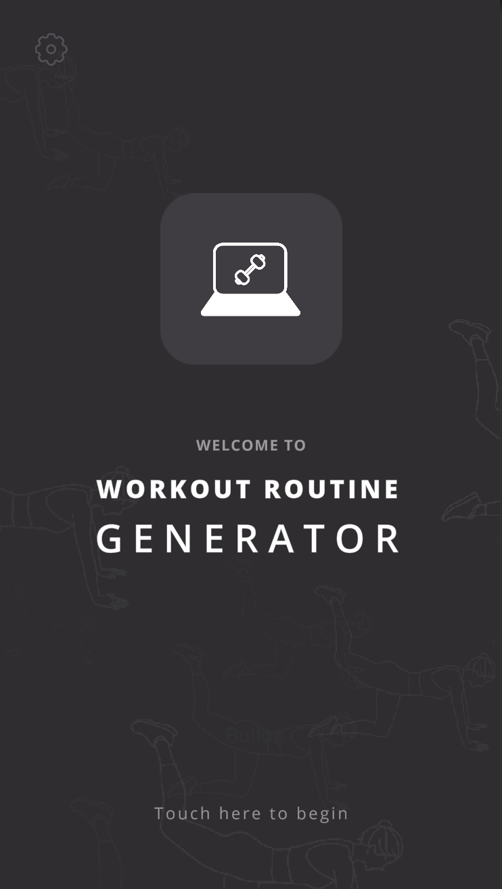
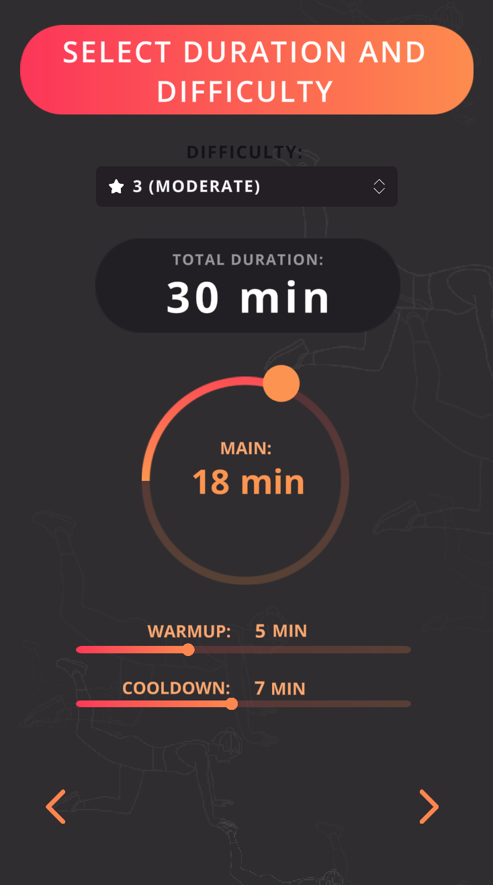
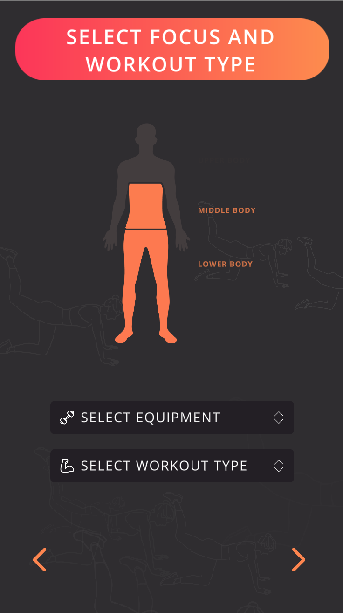
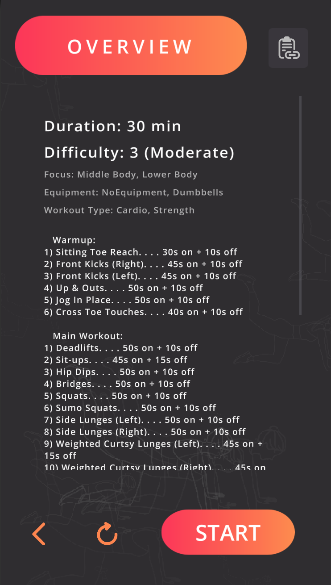
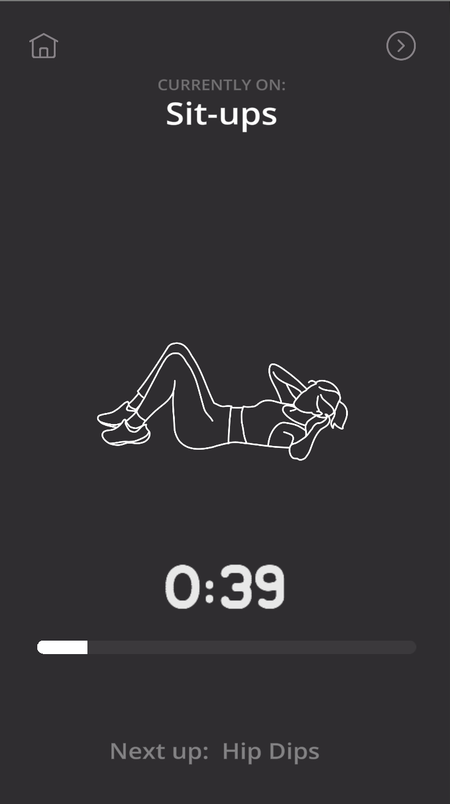

#### Made by Jessica Hammer
# Workout Routine Generator

This app (made in Unity) is designed to randomly generate a workout routine for you. 
Not happy with the selection of excercises it picks? Simply hit the refresh button!
Many settings can be adjusted by the user to suit their training style such as
duration, difficulty, whether they want a warmup or cooldown, the area of focus, equipment, etc.

This app is still under development but here is what it looks like in its current stage:
 

  
  
  
  
  

